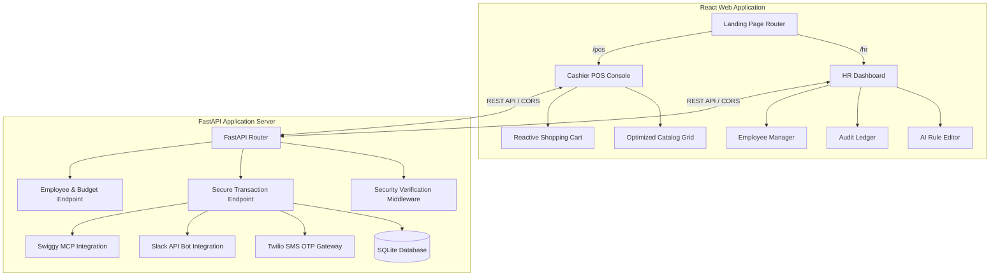

# 🍕 FlexiFeast: Corporate Smart Dining & Wallet Management System

[](https://fastapi.tiangolo.com)
[](https://reactjs.org)
[](https://vitejs.dev)
[](https://tailwindcss.com)
[](https://opensource.org/licenses/MIT)

FlexiFeast is a production-grade corporate dining and smart wallet application designed to streamline employee meal benefits, optimize budget distribution, and facilitate lightning-fast canteen checkout operations.

The system natively bridges onsite canteen checkout via a secure cashier POS terminal with work-from-home (WFH) delivery logistics via Slack chatbots and Swiggy API integrations.

---

## 🏗️ System Architecture

FlexiFeast utilizes a modern decoupled client-server architecture built on a high-performance Python FastAPI backend and a responsive, dynamic React.js frontend:



---

## ✨ Core Features

### 🏢 1. Corporate HR Dashboard
*   **Conversational AI Rule Engine:** An intuitive, natural-language compiler enabling HR admins to input policies in plain English (e.g., *"Limit daily spend to ₹250"*, *"Block desserts after 6 PM"*). The backend parses and complies these rules dynamically.
*   **Audit Ledger & Reconciliation:** A comprehensive digital registry of corporate food spend, tracking transactions with precise splits between corporate wallet deductions and personal out-of-pocket payments. Supporting one-click CSV report exports.
*   **Employee Budget Manager:** A direct interface to allocate, monitor, and top up monthly meal credits for individual employee wallets.

### 🛒 2. Cashier POS (Point of Sale) Console
*   **High-Speed Ordering Grid:** A catalog rendering engine optimized for instant click-to-cart additions with low layout thrashing.
*   **Secure Split-Payment Engine:** When checked out, the application verifies the employee's wallet details and splits the invoice value, deducting from their corporate wallet up to their permitted policy limit and displaying the remaining balance for cash/card.
*   **Dynamic SMS OTP Authorization:** Integration with Twilio allows cashiers to securely authorize wallet deductions via a one-time passcode generated and texted directly to the employee's phone.

### 🍕 3. Work-From-Home (WFH) Integrations
*   **Slack Chatbot Agent:** An interactive chatbot allowing offsite or hybrid employees to browse menus and order meals directly inside their work chat workspace.
*   **Swiggy MCP Deep-Linking:** Automatically translates split-payment math to Swiggy cart configurations, providing customized deep-links with pre-applied corporate discounts and automated out-of-pocket coverage paths.

---

## 🛡️ Security & Performance Hardening

FlexiFeast was audited and refined to address common vulnerability vectors and client performance limitations:

*   **Server-Side Split Validation:** All split-payment mathematics (`wallet_deducted` and `personal_paid` allocations) are fully calculated and validated server-side. The database ignores any mathematical inputs supplied from client network calls, mitigating data-tampering attempts.
*   **SQL Injection & Negative Pricing Protection:** Input fields are validated utilizing Pydantic schemas enforcing numerical properties (e.g., `Field(ge=0)`), ensuring negative quantities or injection sequences are intercepted prior to reaching database transactions.
*   **Restricted CORS Controls:** Replaced wide-open wildcard CORS settings with a dedicated domain whitelist configured dynamically via the environment settings file.
*   **React Component Memoization:** Uses `useCallback` to cache parent handlers and wraps intensive UI blocks (such as `ShoppingCart`) in `React.memo` to eliminate redundant layout renders during inventory navigation.

---

## 📁 Repository Directory Structure

```text
flexifeast/
├── backend/                  # FastAPI Application Codebase
│   ├── app/
│   │   ├── api/              # API Route Controllers
│   │   │   └── endpoints/    # Transactions, Employee, rules endpoints
│   │   ├── core/             # Settings schema, Security routines
│   │   ├── db/               # SQLAlchemy Session and Base Models
│   │   ├── schemas/          # Pydantic Schemas for Strict Input/Output
│   │   ├── services/         # SMS, Slack, Swiggy MCP Integrations
│   │   └── main.py           # Application Entry Point
│   ├── requirements.txt      # Python Dependencies
│   └── Dockerfile            # Containerization Profile
│
├── frontend/                 # React UI Application Codebase
│   ├── src/
│   │   ├── components/       # POS Screen, HR Dashboard, Routing
│   │   ├── context/          # React State Providers
│   │   ├── App.jsx           # Main React Hub
│   │   └── main.jsx          # Entry point
│   ├── package.json          # Node Dependencies
│   └── vite.config.js        # Vite Build Configurations
│
└── README.md                 # Project Core Documentation
```

---

## 🚀 Quick Start Guide

Follow these steps to launch both application layers locally in a development configuration:

### ⚙️ 1. Backend Server Setup

Navigate into the backend workspace, instantiate a virtual environment, and load the required dependencies:

```bash
# 1. Access backend folder
cd backend

# 2. Build Python virtual environment
python -m venv venv

# 3. Activate the virtual environment
# On Windows (PowerShell):
.\venv\Scripts\Activate.ps1
# On macOS/Linux:
source venv/bin/activate

# 4. Install dependency packages
pip install -r requirements.txt
```

#### Configure Environment Variables (`backend/.env`)

Ensure you create or configure `backend/.env` with your variables:

```env
PROJECT_NAME=FlexiFeast
API_V1_STR=/api
DATABASE_URL=your_database_url_here
SECRET_KEY=your_secret_key_here
BACKEND_CORS_ORIGINS=["http://localhost:5173", "http://127.0.0.1:5173"]

# Third-Party Integrations
TWILIO_ACCOUNT_SID=your_twilio_account_sid
TWILIO_AUTH_TOKEN=your_twilio_auth_token
SLACK_BOT_TOKEN=your_slack_bot_token
SWIGGY_MCP_API_URL=https://api.swiggy.com/mcp/v1
SWIGGY_MCP_API_KEY=your_swiggy_mcp_api_key
```

#### Launching the Backend Server

Start the API development server using Uvicorn:

```bash
uvicorn app.main:app --reload --host 0.0.0.0 --port 8000
```

Verify that the interactive API documentation dashboard is accessible at:  
👉 **`http://localhost:8000/docs`** (Swagger UI)

---

### 💻 2. Frontend React Setup

Open a separate terminal window and configure the client package bundle:

```bash
# 1. Access frontend folder
cd frontend

# 2. Install Node packages
npm install
```

#### Configure Environment Variables (`frontend/.env`)

Verify that the API reference path is configured inside `frontend/.env`:

```env
VITE_API_BASE_URL=http://localhost:8000
```

#### Launching the React Development Server

Execute the development script:

```bash
npm run dev
```

The server console will list the active rendering URL. Navigate to the address in your browser:  
👉 **`http://localhost:5173`**

---

## 📊 Environment Configuration Guide

Below is a detailed guide on the configuration parameters supporting FlexiFeast integrations:

### Backend Variables

| Variable | Description | Security Recommendation |
|:---|:---|:---|
| `DATABASE_URL` | SQLAlchemy SQLite or PostgreSQL string path. | Use secure isolated DB in production. |
| `SECRET_KEY` | Cryptographic key utilized for token and data signature validation. | Set to a high-entropy string. |
| `BACKEND_CORS_ORIGINS` | Explicit JSON list of allowed origins. | Restrict strictly to your hosting domain. |
| `TWILIO_ACCOUNT_SID` | SID token supplied by Twilio for SMS dispatch. | Keep secret, load via env only. |
| `TWILIO_AUTH_TOKEN` | Auth Token credential supplied by Twilio. | Keep secret, load via env only. |
| `SWIGGY_MCP_API_KEY` | API signature credential for Swiggy integration. | Keep secret, load via env only. |

### Frontend Variables

| Variable | Description | Default Development Value |
|:---|:---|:---|
| `VITE_API_BASE_URL` | Defines where the React frontend directs its API transactions. | `http://localhost:8000` |

---

## 📜 License

This project is licensed under the MIT License - see the [LICENSE](LICENSE) file for details.
